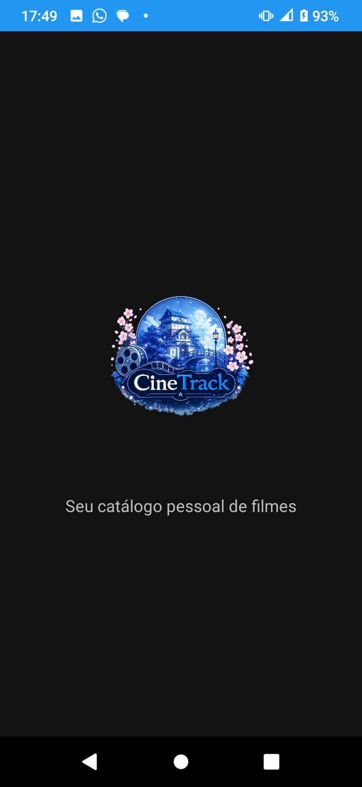
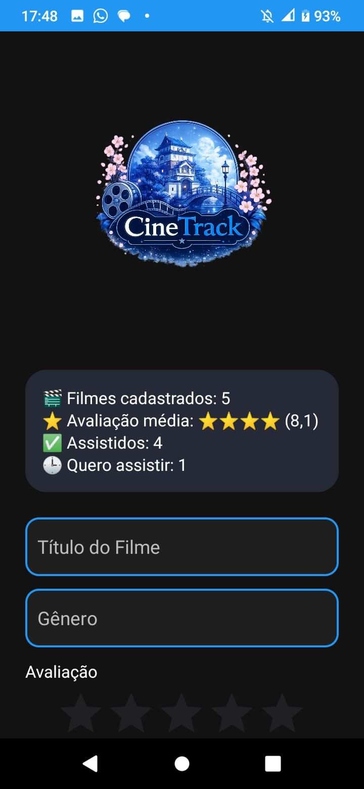
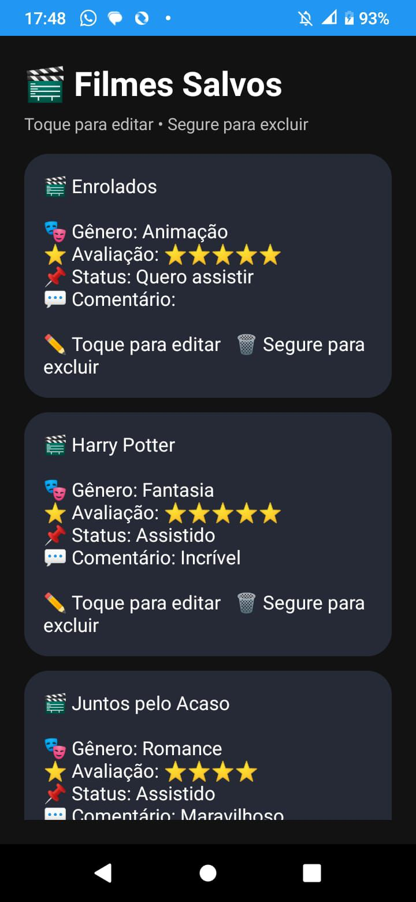
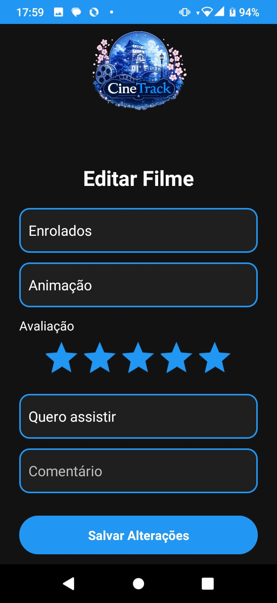

# 🎬 CineTrack

<p align="center">
  
</p>

<p align="center">
Aplicativo Android para gerenciamento pessoal de filmes 🎬
</p>

---

## 📖 Sobre o Projeto

O **CineTrack** é um aplicativo Android desenvolvido em **Java** utilizando **SQLite**, criado para auxiliar usuários no gerenciamento de filmes assistidos e daqueles que desejam assistir.

O aplicativo permite cadastrar filmes, editar informações, excluir registros, avaliar utilizando estrelas, adicionar comentários e acompanhar estatísticas do catálogo por meio de uma interface moderna inspirada no universo do cinema.

---

## ✨ Funcionalidades

- 🎬 Cadastro de filmes
- 📋 Listagem de filmes cadastrados
- ✏️ Edição de filmes
- 🗑️ Exclusão com confirmação
- ⭐ Avaliação por estrelas (RatingBar)
- 🎭 Status do filme (Assistido / Quero Assistir)
- 💬 Comentários pessoais
- 📊 Dashboard com estatísticas
- 🎨 Interface personalizada
- 🚀 Splash Screen
- 📱 Ícone personalizado do aplicativo

---

## 📱 Telas do Aplicativo

| Splash Screen | Tela Principal |
|:--------------:|:--------------:|
|  |  |

| Lista de Filmes | Tela de Edição |
|:---------------:|:--------------:|
|  |  |

---

## 🛠 Tecnologias Utilizadas

- Java
- Android Studio
- SQLite
- XML
- Material Design
- Git
- GitHub

---

## 📂 Estrutura do Projeto

```text
CineTrack
│
├── app
│   ├── src
│   │   ├── main
│   │   │   ├── java
│   │   │   │   ├── database
│   │   │   │   │   └── DatabaseHelper.java
│   │   │   │   ├── model
│   │   │   │   │   └── Filme.java
│   │   │   │   ├── MainActivity.java
│   │   │   │   ├── SplashActivity.java
│   │   │   │   ├── ListaFilmesActivity.java
│   │   │   │   └── EditarFilmeActivity.java
│   │   │   └── res
│   │   │       ├── layout
│   │   │       ├── drawable
│   │   │       └── mipmap
│
├── imagens
│   ├── logo.png
│   ├── splash.jpeg
│   ├── home.jpeg
│   ├── lista.jpeg
│   └── editar.jpeg
│
└── README.md
```

---

## 🚀 Como Executar

1. Clone este repositório:

```bash
git clone https://github.com/sabrinaSMK/CineTrack.git
```

2. Abra o projeto no Android Studio.

3. Aguarde o Gradle sincronizar.

4. Execute o aplicativo em um emulador ou dispositivo Android.

---

## 💾 Banco de Dados

O aplicativo utiliza **SQLite** para armazenar todas as informações localmente no dispositivo, dispensando conexão com a internet para funcionamento.

---

## 👩‍💻 Desenvolvedoras

- Sabrina Mikaela Bessa Brito
- Laura de Matos Martins

---

## 📌 Versão

**CineTrack v1.0**

Projeto desenvolvido para a disciplina de **Desenvolvimento Mobile**.

---

<p align="center">
💙 Desenvolvido com dedicação para organizar seu catálogo pessoal de filmes. 🎬
</p>
